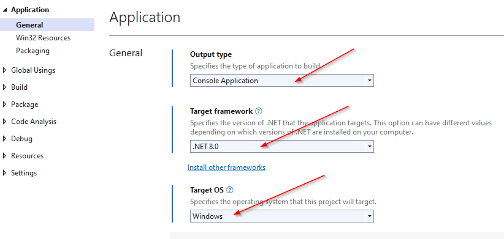
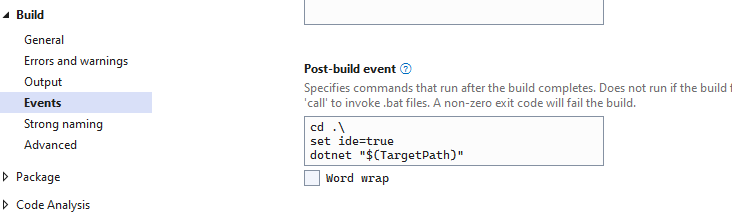

[](https://stand-with-ukraine.pp.ua)

[](https://ci.appveyor.com/project/oleg-shilo/wixsharp)
[](https://www.nuget.org/packages/WixSharp/)
[](https://www.cs-script.net/cs-script/Donation.html)

[](https://www.cs-script.net/cs-script/Donation.html)


# Wix# (WixSharp) - managed interface for WiX

**_Framework for building a complete MSI or WiX source code by using script files written with the C# syntax._**

This is a .NET Core release that is currently under reliability testing. For the product information please visit: https://github.com/oleg-shilo/wixsharp

## How to use

### Create project

_Note, when .NET-Core packages are fully released they will come along with the Visual; Studio project templates as .NET-Framework packages do currently. But until it happens you will need to create your project manually or use this [sample](https://github.com/oleg-shilo/wixsharp/blob/wix-v4-master/Source/src/NET-Core/Sample/Program.cs) as a starting point.'_

Steps:

1. Create an ordinary Console Application project targeting .NET 8 and Windows:
   

2. Set post-build event command to:

   ```txt
   cd .\
   set ide=true
   dotnet "$(TargetPath)"
   ```

   

3. Add Nuget Package `WixSharp.Core`

### Define setup build script

In your Program.cs file define:
```C#
using WixSharp;
using WixToolset.Dtf.WindowsInstaller;
using File = WixSharp.File;

Console.WriteLine(Environment.CurrentDirectory);

var project =
    new Project("My Product",
        new Dir(@"%ProgramFiles%\My Company\My Product",
            new File("program.cs")),
        new ManagedAction(Actions.CustomAction),
        new ManagedAction(Actions.CustomAction2),
        new Property("PropName", "<your value>")); ;

project.PreserveTempFiles = true;

project.UI = WUI.WixUI_ProgressOnly;

project.BuildMsi();

// -----------------------------------------------
public class Actions
{
    [CustomAction]
    public static ActionResult CustomAction(Session session)
    {
        Native.MessageBox("MSI Session\nINSTALLDIR: " + session.Property("INSTALLDIR"), "WixSharp - .NET8");

        return ActionResult.Success;
    }

    [CustomAction]
    public static ActionResult CustomAction2(Session session)
    {
        SetupEventArgs args = session.ToEventArgs();

        Native.MessageBox("WixSharp RuntimeData\nMsiFile: " + args.MsiFile, "WixSharp - .NET8");

        return ActionResult.UserExit; // terminate the setup
    }
}
```

When you build the project the MSI will be produced in your project root folder.

Note, because custom action are AOT compiled they have tendency to grow in size and add build time overhead try to avoid adding to much code that has other library dependencies unless you are OK with the impact.

Thus the custom action above uses `Native.MessageBox` which is nothing else but a Win32 MessageBox function. In the test environment the compile time is ~10 seconds. However replacing it with `System.Windows.Forms.MessageBox` adds quite a few aditional assemblies (e.g. WPF) and bumps compile time to a minute. This is a limitation of AOT compilation.  
